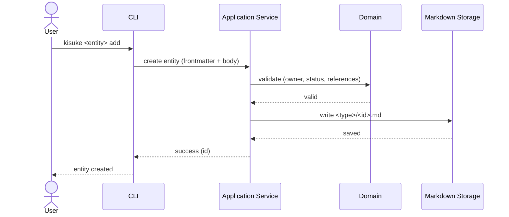

# Capture Flow

> Source: docs/architecture/07-user-flows.md (Flow 2 — Capture Information), docs/engineering/12-engineering-architecture.md (Storage Architecture).

Capture must be frictionless. Classification never blocks capture.

## Rules

- One entity = one Markdown file.
- Relationships stored by ID only.
- Derived index/cache are rebuilt, never authored by capture.
