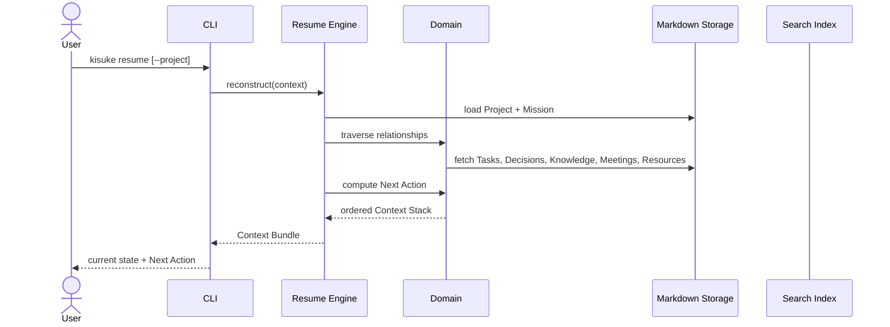

# Resume Flow

> Source: docs/architecture/07-user-flows.md (Flow 1 — Resume Work), docs/architecture/05-information-architecture.md (Resume Order, Context Stack), docs/engineering/12-engineering-architecture.md (Resume Architecture).

The primary capability of Kisuke. Deterministic context reconstruction.

## Resume Order (fixed)

1. Mission
2. Project
3. Project Status
4. Current State
5. Next Action
6. Active Tasks
7. Recent Decisions
8. Relevant Knowledge
9. Related Meetings
10. Related Resources
11. Attachments

## Performance Target

Resume < 2 seconds (warm cache).
