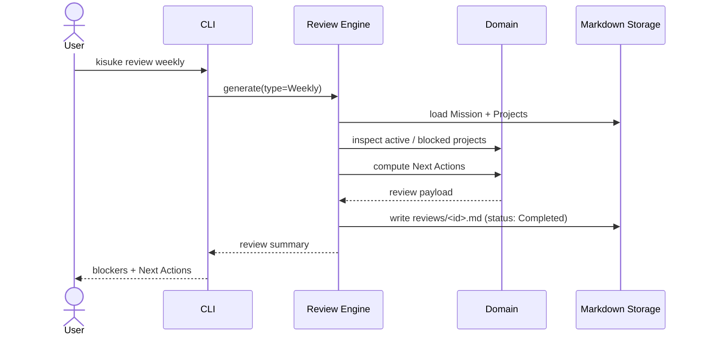

# Review Flow

> Source: docs/architecture/07-user-flows.md (Flow 7 — Review), docs/execution/13-roadmap.md (M7 — Review System).

## Supported Reviews

- Morning
- Weekly
- Monthly
- Quarterly

A Review is owned by its Mission.
