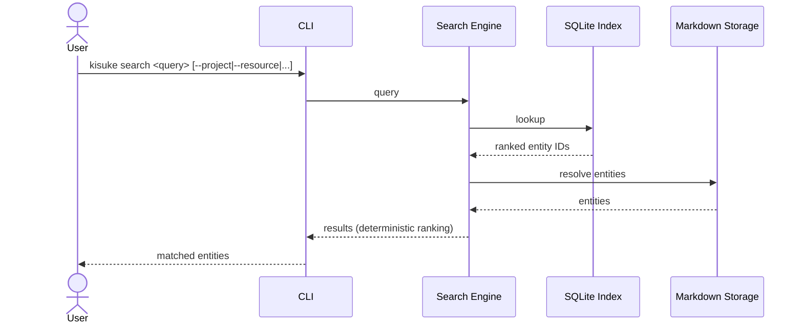

# Search Flow

> Source: docs/architecture/07-user-flows.md (Flow 8 — Search), docs/engineering/12-engineering-architecture.md (Search Architecture).

Search is a supporting capability. It exists to support resumption, never to
replace it.

## Search Order (fallback scope)

1. Current Context
2. Current Project
3. Mission
4. Cookbook
5. Entire Repository (global search is the final step)

## Performance Target

Warm search < 500 ms.
