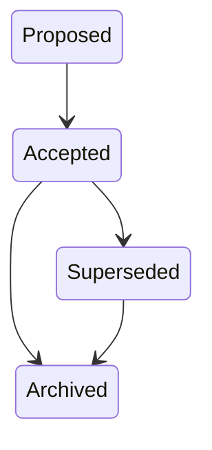

# Decision State Machine

> Source: docs/architecture/04-domain-model.md (Entity Lifecycles), docs/architecture/06-data-model.md (Status Values).

## States

| State | Meaning |
|--------|---------|
| Proposed | Under consideration |
| Accepted | Chosen |
| Superseded | Replaced by a later decision |
| Archived | Historical |

## Transitions

Archiving is one-way through the `status` field; there is no separate `archived`
boolean.
