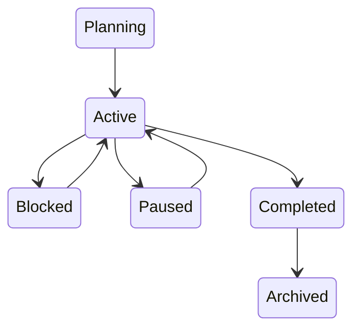

# Project State Machine

> Source: docs/architecture/04-domain-model.md (Entity Lifecycles), docs/architecture/06-data-model.md (Status Values).

## States

| State | Meaning |
|--------|---------|
| Planning | Not started |
| Active | In progress |
| Blocked | Cannot continue |
| Paused | Intentionally stopped |
| Completed | Finished |
| Archived | Historical |

## Transitions

Archiving is one-way through the `status` field; there is no separate `archived`
boolean.
