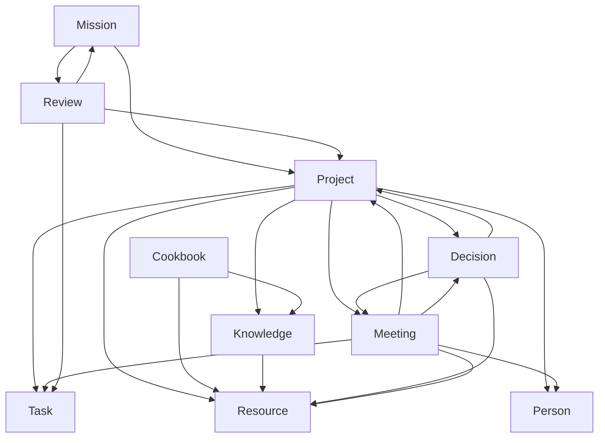
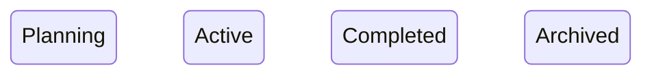
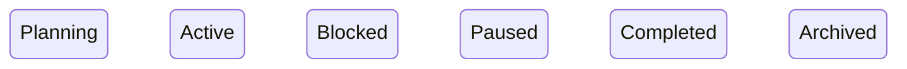
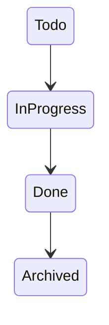
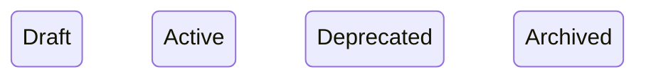
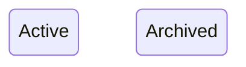
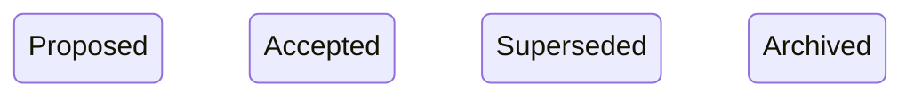
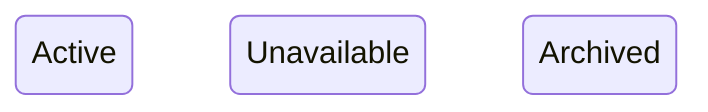
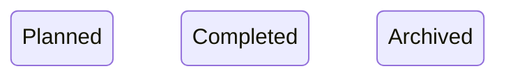

# Domain Model

> Source: MASTER_SPECIFICATION.md §5

---

# Purpose

The Domain Model defines the canonical business entities of Kisuke.

Every feature, workflow, CLI command, and data model depends on these entities.

This document defines:

- Entities
- Ownership
- Relationships
- Lifecycles
- Invariants

Implementation must not introduce entities outside this model.

---

# Domain Principles

The domain follows five immutable principles:

- Every entity has exactly one owner.
- Relationships never imply ownership.
- References are preferred over duplication.
- IDs are globally unique.
- Markdown is the source of truth.

---

# Core Entities

## Mission

### Purpose

Represents a long-term objective that guides priorities.

Examples

- Become an AI Engineer
- Graduate College
- Build Kisuke
- Launch Startup

### Owner

Kisuke Core

### Responsibilities

- Owns Projects
- Owns Reviews
- Defines long-term direction
- Determines priority

### Does NOT Own

- Resources
- Meetings
- People
- Cookbook

---

## Project

### Purpose

A temporary endeavor with a defined beginning and end undertaken to create a unique outcome.

Examples

- Kisuke
- Portfolio Website
- AI Resume Builder

### Owner

Mission

### Responsibilities

- Own Tasks
- Own Knowledge
- Own Decisions
- Maintain current state
- Define Next Action

### Does NOT Own

- Resources
- Meetings
- People

---

## Task

### Purpose

The smallest executable unit of work.

Every task belongs to exactly one Project.

### Examples

- Implement CLI
- Fix parser
- Write README
- Review PR

### Owner

Project

### Responsibilities

- Represent executable work
- Track completion
- Support Next Action

---

## Knowledge

### Purpose

Information collected while executing a Project.

Knowledge exists because of a Project.

Examples

- API documentation summary
- Research notes
- Bug investigation
- Design explanation

### Owner

Project

### Responsibilities

- Preserve understanding
- Support future work
- Reference Resources

---

## Cookbook

### Purpose

Evergreen reusable knowledge.

Cookbook is independent of Projects.

Examples

- Git commands
- Docker cheatsheet
- Python snippets
- Linux commands

### Owner

Kisuke Core

### Responsibilities

- Store reusable knowledge
- Avoid duplication across Projects

---

## Decision

### Purpose

Records why something was chosen.

Examples

- Selected SQLite
- Switched from JSON to Markdown
- Rejected cloud-first architecture

### Owner

Project

### Responsibilities

- Preserve reasoning
- Prevent repeated discussions
- Explain historical choices

---

## Meeting

### Purpose

Represents a discussion occurring at a specific time.

Examples

- Standup
- Builder meeting
- Mentor session

### Owner

Independent

### Responsibilities

- Record outcomes
- Reference related work
- Preserve meeting context

---

## Person

### Purpose

Represents an individual related to work.

Examples

- Mentor
- Teammate
- Recruiter
- Client

### Owner

Independent

### Responsibilities

- Represent people
- Link conversations
- Link meetings

---

## Resource

### Purpose

Represents an external source of information.

Examples

- Documentation
- GitHub repository
- PDF
- Website
- Video
- Dataset

### Owner

Independent

### Responsibilities

- Reference external knowledge
- Avoid duplicated content

---

## Review

### Purpose

Structured inspection of current work.

Types

- Morning
- Weekly
- Monthly
- Quarterly

### Owner

Mission

### Responsibilities

- Evaluate progress
- Surface blockers
- Keep system healthy

---

## Attachment

### Purpose

Binary asset attached to another entity.

Examples

- Image
- PDF
- ZIP
- Screenshot

### Owner

Parent Entity

### Responsibilities

- Preserve binary information
- Never exist independently

---

# Ownership Model

Ownership defines responsibility.

Relationships define references.

Ownership and relationships are independent.

---

## Ownership Hierarchy

```text
Kisuke Core
├── Mission
│   ├── Project
│   │   ├── Task
│   │   ├── Knowledge
│   │   └── Decision
│   └── Review
│
└── Cookbook

Independent
├── Meeting
├── Person
└── Resource

Parent Entity
└── Attachment
```

The Kisuke Core, Independent, and Parent Entity owner categories are ownership *categories*, not entity instances — they have no UUID of their own. How each is represented in the `owner` field of a stored entity is defined in docs/architecture/06-data-model.md, Owner Value Rules.

---

## Ownership Rules

### Rule 1

Every entity has exactly one owner.

---

### Rule 2

Ownership never changes automatically.

---

### Rule 3

Relationships never imply ownership.

---

### Rule 4

Independent entities are not owned by any domain entity.

---

### Rule 5

Attachments are always owned by exactly one parent entity.

---

# Relationship Model

Relationships are references.

They never duplicate data.

---

## Mission

Outgoing

- Projects
- Reviews

Incoming

None

---

## Project

Outgoing

- Tasks
- Knowledge
- Decisions
- Meetings
- Resources
- People

Incoming

- Mission

---

## Task

Outgoing

None

Incoming

- Project
- Meeting
- Review

---

## Knowledge

Outgoing

- Resources

Incoming

- Project
- Cookbook

---

## Cookbook

Outgoing

- Knowledge
- Resources

Incoming

None

---

## Decision

Outgoing

- Project
- Resources
- Meetings

Incoming

- Project
- Meeting

---

## Meeting

Outgoing

- Projects
- Tasks
- Decisions
- People
- Resources

Incoming

- Project

---

## Person

Outgoing

None

Incoming

- Project
- Meeting

---

## Resource

Outgoing

None

Incoming

- Project
- Meeting
- Knowledge
- Decision
- Cookbook

---

## Review

Outgoing

- Mission
- Projects
- Tasks

Incoming

- Mission

---

## Attachment

Outgoing

None

Incoming

- Parent Entity

---

# Relationship Diagram



---

# Cardinality

| Relationship | Cardinality |
|-------------|------------|
| Mission → Project | 1:N |
| Mission → Review | 1:N |
| Project → Task | 1:N |
| Project → Knowledge | 1:N |
| Project → Decision | 1:N |
| Project → Meeting | N:N |
| Project → Resource | N:N |
| Project → Person | N:N |
| Cookbook → Knowledge | 1:N |
| Cookbook → Resource | N:N |
| Knowledge → Resource | N:N |
| Decision → Project | N:N |
| Decision → Resource | N:N |
| Decision → Meeting | N:N |
| Meeting → Project | N:N |
| Meeting → Task | N:N |
| Meeting → Decision | N:N |
| Meeting → Person | N:N |
| Meeting → Resource | N:N |
| Review → Mission | N:N |
| Review → Project | N:N |
| Review → Task | N:N |

---

# Relationship Invariants

- Relationships never transfer ownership.
- Relationships are directional.
- Relationships may be optional unless stated otherwise.
- Circular relationships are allowed only when they do not create circular ownership.
- Every relationship references an existing entity.
- Deleted entities must remove or update dangling references.

---

# Entity Lifecycles

A lifecycle defines the valid states an entity may occupy.

It does not imply mandatory transitions unless explicitly stated.

---

## Mission



States

| State | Meaning |
|--------|---------|
| Planning | Mission defined |
| Active | Currently pursued |
| Completed | Objective achieved |
| Archived | Historical |

---

## Project



| State | Meaning |
|--------|---------|
| Planning | Not started |
| Active | In progress |
| Blocked | Cannot continue |
| Paused | Intentionally stopped |
| Completed | Finished |
| Archived | Historical |

---

## Task



---

## Knowledge



---

## Cookbook



Cookbook entries remain Active until explicitly archived.

---

## Decision



---

## Meeting


---

## Person


---

## Resource



`Unavailable` reflects that the external source the Resource points to can no longer be reached, while its metadata is preserved (see docs/architecture/07-user-flows.md, Failure Cases § Missing Resource).

---

## Review



---

## Attachment


---

# Global Invariants

These rules are always true.

## Ownership

- Every entity has exactly one owner.
- Ownership is explicit.
- Ownership never changes automatically.
- Ownership is never inferred.

---

## Identity

- Every entity has a globally unique ID.
- IDs never change.
- IDs are immutable.

---

## Relationships

- References never imply ownership.
- No duplicated relationships.
- References always point to existing entities.
- Relationship direction is explicit.

---

## Storage

- Markdown is canonical.
- Derived indexes may be rebuilt.
- Cached data is disposable.

---

## AI

- AI owns nothing.
- AI never becomes the source of truth.
- AI outputs are always derived.

---

## History

- Git owns history.
- Kisuke stores current state.
- Kisuke never replaces Git history.

---

## Core

- Core is provider-independent.
- Core is integration-independent.
- Core has no knowledge of AI providers.

---

## Integrity Constraints

The following must always hold.

### Mission

- Owns zero or more Projects.
- Owns zero or more Reviews.

---

### Project

- Must belong to exactly one Mission.
- Must have exactly one owner.
- May own many Tasks.
- May own many Decisions.
- May own many Knowledge entries.

---

### Task

- Must belong to exactly one Project.
- May be the Next Action.
- At most one active Next Action exists per Project.

---

### Knowledge

- Must belong to exactly one Project.
- May reference many Resources.

---

### Cookbook

- Exists independently.
- Never belongs to a Project.

---

### Decision

- Must belong to exactly one Project.
- Never exists without context.

---

### Meeting

- Exists independently.
- May reference many entities.

---

### Person

- Exists independently.
- Never owns Projects.

---

### Resource

- Exists independently.
- May be referenced many times.

---

### Review

- Must belong to exactly one Mission.

---

### Attachment

- Must have exactly one Parent Entity.
- Cannot exist independently.

---

# Validation Rules

The Domain Model is valid only if all of the following conditions hold.

## Ownership

✓ Every entity has exactly one owner.

✓ No entity has multiple owners.

✓ Ownership is explicit.

---

## Relationships

✓ Every relationship references an existing entity.

✓ Relationships never imply ownership.

✓ Relationship direction is preserved.

✓ No duplicate relationships exist.

---

## Identity

✓ Every entity has a globally unique ID.

✓ IDs never change.

✓ IDs are immutable.

---

## Storage

✓ Markdown remains the canonical source.

✓ Derived indexes may be rebuilt at any time.

✓ AI outputs are never canonical.

---

## Architecture

✓ No entity exists outside this document.

✓ No implementation may introduce new entities.

✓ No implementation may redefine ownership.

✓ No implementation may redefine relationships.

---

# Examples

## Example 1 — Mission → Project → Task

Mission

```
Become AI Engineer
```

↓

Project

```
Build Kisuke
```

↓

Task

```
Implement CLI
```

---

## Example 2 — Knowledge

Project

```
Kisuke
```

Knowledge

```
SQLite indexing research
```

Resource

```
SQLite documentation
```

Knowledge references the Resource.

The Resource is not duplicated.

---

## Example 3 — Cookbook

Cookbook

```
Git Commands
```

Used by:

- Kisuke
- Portfolio
- Resume Builder

The Cookbook entry exists once.

Every Project references it.

---

## Example 4 — Decision

Decision

```
Use Markdown as source of truth.
```

Reason

```
Portable
Version controlled
Human readable
```

The Decision belongs to the Project.

---

## Example 5 — Meeting

Meeting

```
Weekly Review
```

References

- Project
- Tasks
- Decisions
- Resources

Meeting owns none of them.

---

## Example 6 — Review

Mission

```
Become AI Engineer
```

Weekly Review

Checks

- Active Projects
- Blocked Projects
- Next Actions

Review belongs to the Mission.

---

## Example 7 — Attachment

Attachment

```
architecture.png
```

Parent

```
Decision
```

The Attachment cannot exist without its Parent Entity.

---

# Domain Glossary

| Term | Definition |
|------|------------|
| Mission | Long-term objective |
| Project | Temporary effort producing a unique outcome |
| Task | Smallest executable work item |
| Knowledge | Project-specific information |
| Cookbook | Evergreen reusable knowledge |
| Decision | Recorded reasoning |
| Meeting | Time-bounded discussion |
| Person | Individual related to work |
| Resource | External source of information |
| Review | Structured evaluation |
| Attachment | Binary asset owned by another entity |

---

# Domain Guarantees

The Domain Model guarantees:

- Stable ownership.
- Predictable relationships.
- Minimal duplication.
- Explicit structure.
- Long-term maintainability.
- Provider independence.
- Offline compatibility.

---

# Acceptance Criteria

This document is complete when:

- Every entity is defined.
- Every owner is defined.
- Every relationship is defined.
- Every lifecycle is defined where applicable.
- Every invariant is documented.
- Every implementation can map directly to this model.
- No ambiguity remains.

---

# Final Principle

The Domain Model is the foundation of Kisuke.

Every future feature, API, CLI command, plugin, integration, database schema, search index, and AI capability must derive from this model.

No implementation may contradict it.